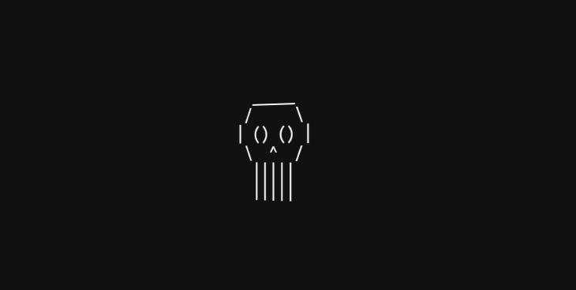

# ROSTO 3D ASCII
👨‍🏫UMA CARINHA SORRIDENTE DENTRO DE UM QUADRADO GIRA NO ESPAÇO TRIDIMENSIONAL.

  

## DESCRIÇÃO:
Este projeto é uma página web simples que cria um efeito visual de rotação 3D em torno de um desenho em ASCII, utilizando apenas HTML e CSS. O objetivo é fazer com que uma arte em caracteres ASCII (neste caso, uma carinha sorridente dentro de um quadrado) gire no eixo Y, dando a impressão de estar "girando" no espaço tridimensional.

## NÃO SABE?
- Entendemos que para manipular arquivos em `HTML`, `CSS` e outras linguagens relacionadas, é necessário possuir conhecimento nessas áreas. Para auxiliar nesse aprendizado, oferecemos cursos gratuitos disponíveis:
* [CURSO DE HTML E CSS](https://github.com/VILHALVA/CURSO-DE-HTML-E-CSS)
* [CONFIRA MAIS CURSOS](https://github.com/VILHALVA?tab=repositories&q=+topic:CURSO)

## CREDITOS:
- [PROJETO CRIADO PELO VILHALVA](https://github.com/VILHALVA)

